# 🖥️ Active Directory Help Desk Administration Lab


## Overview

This project simulates common Tier 1 and Tier 2 Help Desk responsibilities within an enterprise Active Directory environment.

The lab was built using Windows Server 2025 and a Windows 11 domain-joined workstation to demonstrate:

- User Administration
- Security Group Management
- Password Resets
- Account Unlocks
- Workstation Management
- PowerShell Automation
- Active Directory Administration

---

## Lab Environment

```text
+-------------------------+
| Windows Server 2025     |
| DC01                    |
| Active Directory        |
+------------+------------+
             |
             |
+------------v------------+
| CLIENT01                |
| Windows 11              |
| Domain Joined           |
+------------+------------+
             |
             |
+------------v------------+
| Help Desk Administration|
| User Management         |
| Group Management        |
| PowerShell Automation   |
+-------------------------+
```

---

## Objectives

- Create Active Directory Organizational Units
- Create and manage user accounts
- Create and manage security groups
- Reset user passwords
- Unlock user accounts
- Disable and re-enable users
- Move computer objects
- Generate reports using PowerShell
- Automate user creation using CSV imports

---

## Technologies Used

| Technology | Purpose |
|------------|----------|
| Windows Server 2025 | Domain Controller |
| Active Directory | Identity Management |
| Windows 11 | Client Endpoint |
| PowerShell | Administration & Automation |
| CSV Imports | Bulk User Provisioning |

---

## Active Directory Structure

```text
HelpDesk-Lab
│
├── Users
├── Computers
├── Groups
├── Disabled-Users
├── Service-Accounts
└── Contractors
```

---

## 1. Created Active Directory Users

Created user accounts inside the Users Organizational Unit.

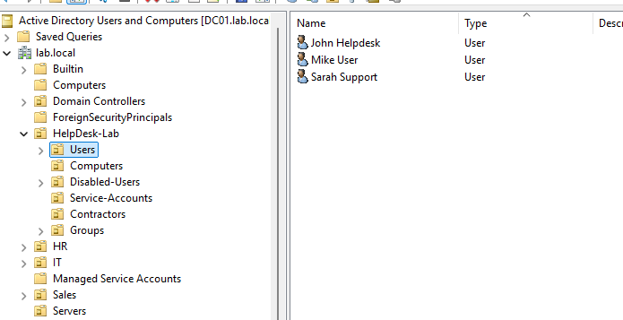

Users created:

- John Helpdesk
- Sarah Support
- Mike User
- Lisa User

---

## 2. Created Security Groups

Created security groups used for role-based access control.

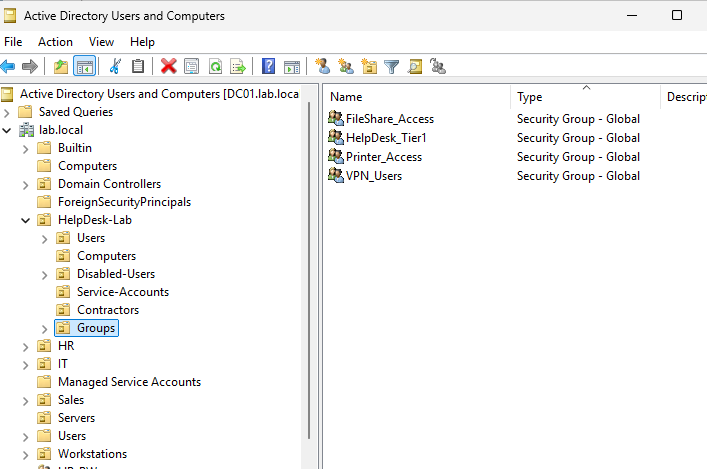

Groups created:

- HelpDesk_Tier1
- VPN_Users
- Printer_Access
- FileShare_Access

---

## 3. Bulk User Creation with PowerShell

Automated user provisioning using CSV imports.

```powershell
Import-Csv C:\helpdesk-users.csv | ForEach-Object {

    New-ADUser `
    -Name "$($_.FirstName) $($_.LastName)" `
    -GivenName $_.FirstName `
    -Surname $_.LastName `
    -SamAccountName $_.Username `
    -UserPrincipalName "$($_.Username)@lab.local" `
    -Path "OU=Users,OU=HelpDesk-Lab,DC=lab,DC=local" `
    -AccountPassword (ConvertTo-SecureString "Password123!" -AsPlainText -Force) `
    -Enabled $true

}
```

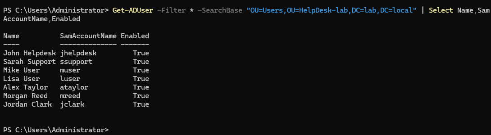

Additional users created:

- Alex Taylor
- Morgan Reed
- Jordan Clark

---

## 4. Password Reset Administration

Performed password reset operations for user accounts.

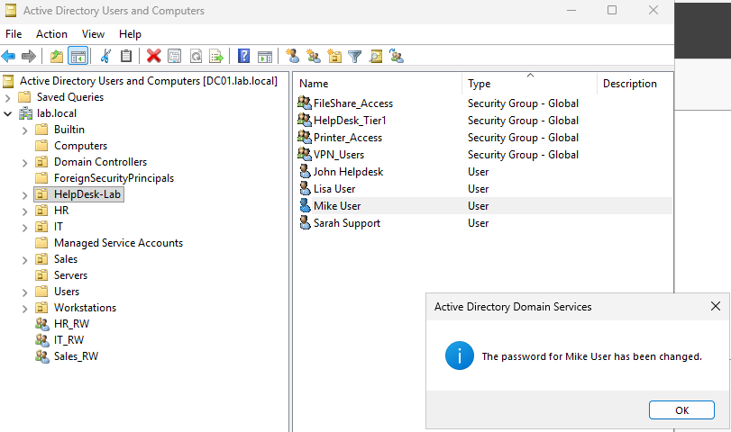

Tasks demonstrated:

- User identity verification
- Password reset
- Account recovery

---

## 5. Account Unlock Operations

Unlocked user accounts after lockout events.

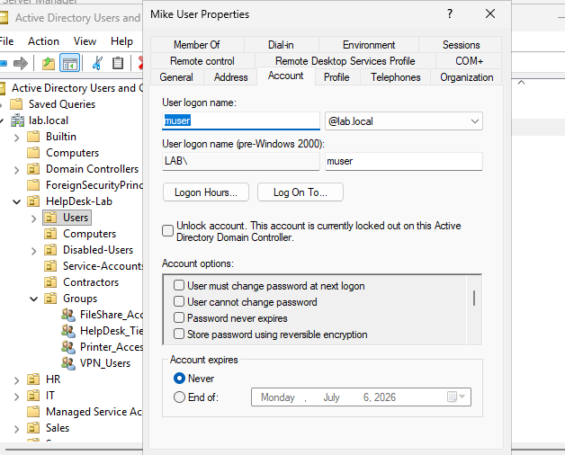

PowerShell command:

```powershell
Search-ADAccount -LockedOut -UsersOnly
Unlock-ADAccount username
```

---

## 6. Disable and Re-Enable User Accounts

Disabled inactive accounts.

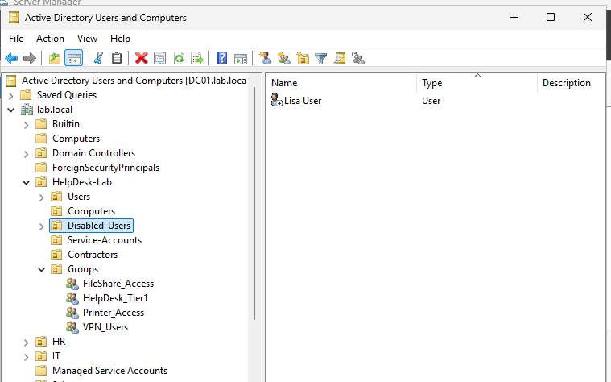

Re-enabled accounts when needed.

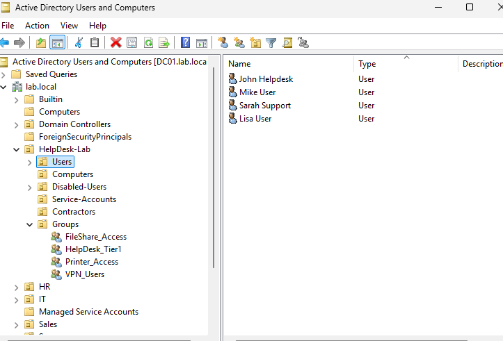

Common Help Desk scenarios:

- Employee termination
- Leave of absence
- Security investigations

---

## 7. Computer Object Administration

Moved CLIENT01 into the Computers Organizational Unit.

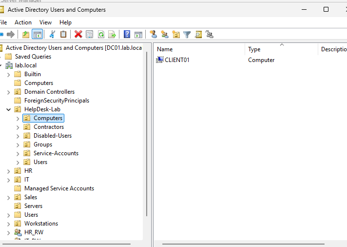

Tasks demonstrated:

- Workstation administration
- Organizational Unit management
- Asset organization

---

## 8. User Login Verification

Verified authentication and group membership.

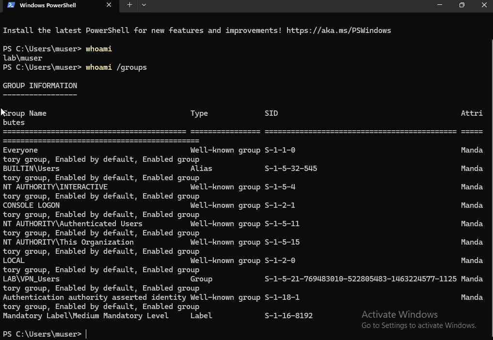

Commands used:

```powershell
whoami
whoami /groups
```

---

## 9. PowerShell User Reporting

Generated Active Directory user reports.

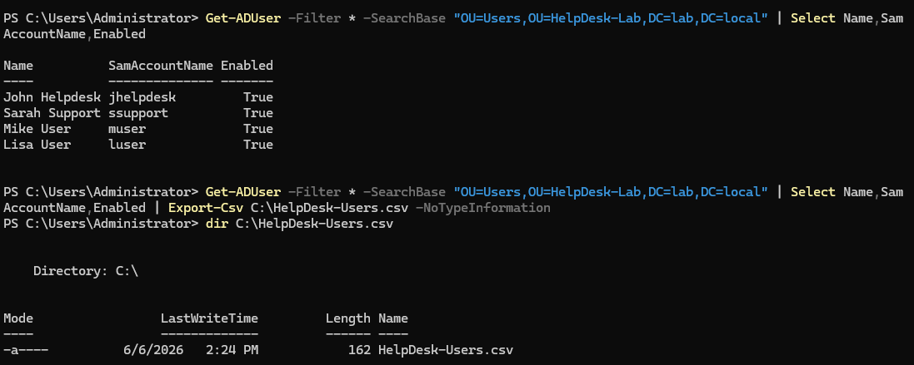

```powershell
Get-ADUser -Filter * `
-SearchBase "OU=Users,OU=HelpDesk-Lab,DC=lab,DC=local" |
Select Name,SamAccountName,Enabled |
Export-Csv C:\HelpDesk-Users.csv -NoTypeInformation
```

---

## 10. Security Auditing

### Disabled Accounts

Identified disabled user accounts.

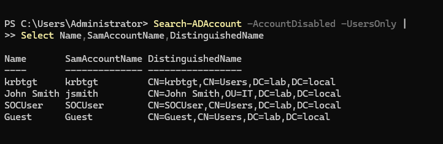

```powershell
Search-ADAccount -AccountDisabled -UsersOnly
```

### Locked Accounts

Verified account lockout status.

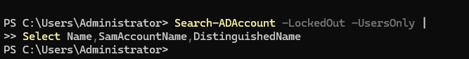

```powershell
Search-ADAccount -LockedOut -UsersOnly
```

---

## Troubleshooting

### Issue #1 - CSV User Import Failed

#### Error

```text
A parameter cannot be found that matches parameter name 'AccountPasword'
```

#### Root Cause

Misspelled parameter:

```powershell
-AccountPasword
```

#### Resolution

Corrected spelling:

```powershell
-AccountPassword
```

---

### Issue #2 - PowerShell Stuck at >> Prompt

#### Symptoms

```text
>>
>>
>>
```

#### Root Cause

Incomplete PowerShell command block.

#### Resolution

Verified:

- Opening and closing braces
- Quotation marks
- Backtick placement

---

### Issue #3 - SearchBase Path Error

#### Error

```text
Directory object not found
```

#### Root Cause

Incorrect Distinguished Name (DN).

#### Resolution

Corrected path:

```powershell
OU=Users,OU=HelpDesk-Lab,DC=lab,DC=local
```

---

## Skills Demonstrated

- Active Directory Administration
- User Lifecycle Management
- Password Management
- Account Recovery
- Security Group Administration
- Workstation Administration
- PowerShell Automation
- CSV Imports
- Identity and Access Management (IAM)
- Help Desk Operations
- Troubleshooting

---

## Resume Highlights

- Built and administered a Windows Server 2025 Active Directory environment.
- Created and managed Organizational Units, users, groups, and workstation objects.
- Automated user provisioning using PowerShell and CSV imports.
- Performed password resets, account unlocks, and user lifecycle administration.
- Generated Active Directory reports using PowerShell.
- Troubleshot Active Directory administration and account management issues.

---

## Future Improvements

- Group Policy Administration
- Roaming Profiles
- Folder Redirection
- File Share Permissions
- NTFS Permission Auditing
- Login Scripts
- Microsoft 365 Integration
- Azure AD / Entra ID Integration

---

## Author

### Brandon Cooper

IT Support | Active Directory | PowerShell | Cybersecurity

GitHub:
https://github.com/brandonjcooper1981-code

LinkedIn:
https://www.linkedin.com/in/brandon-cooper-070526375
